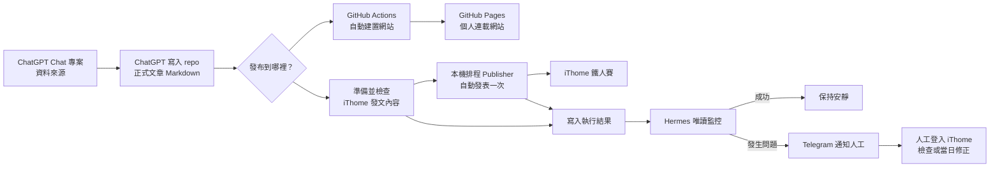

# iThome 2026 連載網站

以 Astro 建置的 2026 iThome 鐵人賽個人連載網站。

## 開發

```bash
pnpm install
pnpm dev
```

## 內容

文章原稿來自 ChatGPT Chat 專案的「資料來源」。ChatGPT 已獲授權操作這個 repo，因此可以把整理完成的文章直接寫入 `src/content/posts/`。匯入後，每篇文章會使用固定的 `day` 編號，產生 `/day/01/`～`/day/30/` 網址。

正式發布前請設定正確的 `publishDate`，並將 `draft` 改為 `false`。每日 GitHub Actions 會重新建置網站；尚未到發布日期的文章不會出現在網站上。

## 自動發布架構

文章先在 ChatGPT Chat 專案的「資料來源」整理。因為 ChatGPT 已獲授權操作這個 repo，所以能直接把文章寫入 repo。匯入後的同一份 Markdown 會分別發布到 GitHub Pages 和 iThome，不需要為兩個網站各準備一份文章。



### 文章從哪裡來？

文章不是在這個 repo 裡從零開始撰寫。原稿先放在 ChatGPT Chat 專案的「資料來源」，完成整理後，由已獲授權的 ChatGPT 直接寫入 `src/content/posts/`。從寫入完成開始，repo 裡的 Markdown 就是網站建置與 iThome 發文共同使用的內容。

這項授權只代表 ChatGPT 可以操作此 repo，不代表 ChatGPT、Publisher 或 Hermes 可以互相取得對方的登入資料。iThome 登入狀態與 Telegram 憑證仍維持隔離。

### GitHub Pages 如何自動發布？

GitHub Actions 每天會自動建置一次 Astro 網站。文章的 `publishDate` 已經到期，而且 `draft` 設為 `false` 時，文章就會出現在個人連載網站；尚未到日期的文章不會提早公開。

### iThome 如何自動發布？

本機排程 Publisher 會先從 repo 產生固定格式的發文資料，再檢查日期、標題、文章內容及是否重複發布。全部通過後，才會使用已登入的 iThome 瀏覽器自動發表一次。

這套流程的目標是「無人值守」：正常時不需要有人守在電腦前，也不需要每天按下確認。若登入失效、找不到文章、資料不一致、重複發布、遇到 Cloudflare，或無法確定是否發布成功，Publisher 會立刻停止，不會一直重試或重複按下發表。

### Hermes 負責什麼？

Publisher 每次執行後，只會留下不含文章正文、登入 cookie 或 Telegram 密碼的結果檔案。Mac 上有一個隔離的本機使用者 `hermes`，它只能讀取這些結果，不能登入 iThome、不能代替 Publisher 發文，也不能改寫共享資料。

Hermes 平常保持安靜。只有缺稿、重複、內容不符、發布失敗、結果不確定或逾時等異常，才會透過既有的 Telegram Gateway 通知人工。收到通知後，人工再登入 iThome 檢查；因為文章在發文當天仍可編輯，也可以視情況手動修正。

### 目前做到哪裡？

目前已完成發文資料與事件格式測試、Hermes 讀取權限驗證、重複事件過濾、成功時保持靜默、異常通知及恢復通知等開賽前整合驗收。

新的無人值守 Publisher runner、正式賽事排程及真實 iThome 發布目前尚未啟用。**真正的 Day 1 系列建立、後續每日自動發文、2026 公開系列頁監控，以及發文後的異常恢復，仍待實際開賽驗證。**

## Codex 發文 skill

專案內包含 [`ithome-ironman-publisher`](.agents/skills/ithome-ironman-publisher/README.md) Codex skill。它以 `pnpm ithome:prepare` 的輸出作為唯一 iThome 內容來源，負責準備資料、檢查草稿及記錄執行結果。

目前使用 Codex Computer Use 操作瀏覽器的版本仍受平台安全規則限制，公開發表前可能要求人工確認；這和目標中的「無人值守 Publisher runner」是兩套不同的執行方式。README 的架構圖描述的是準備導入的新架構，不代表目前已能在無人看管時正式發布。

skill、契約文件與 deterministic helpers 可以隨 repo 共同審查；登入 session、cookie、跨使用者 runtime state 與 Telegram credential 不得提交到 Git。

## License

本專案採用 [MIT License](LICENSE)。
