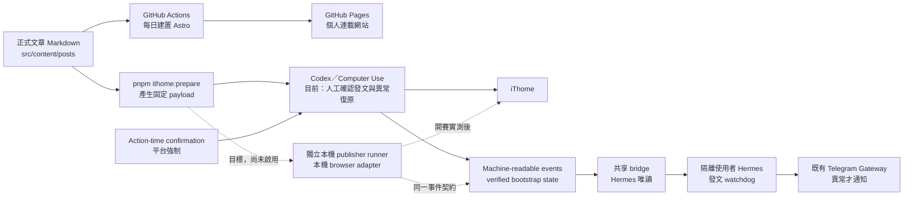

# iThome 2026 連載網站

以 Astro 建置的 2026 iThome 鐵人賽個人連載網站。

## 開發

```bash
pnpm install
pnpm dev
```

## 內容

文章放在 `src/content/posts/`，每篇使用固定 `day` 編號產生 `/day/01/`～`/day/30/` 網址。

正式發布前請設定正確的 `publishDate`，並將 `draft` 改為 `false`。每日 GitHub Actions 會重新建置網站；尚未到發布日期的文章不會出現在網站上。

## 發布架構

`src/content/posts/` 是唯一正式文章來源。同一份 Markdown 會沿著兩條發布路徑運作：



1. **GitHub Pages**：GitHub Actions 每日自動建置 Astro 網站，依文章的 `publishDate` 與 `draft` 狀態發布到個人連載網站。
2. **目前的 iThome 能力**：Codex publisher 從 repo 產生固定格式的 payload，再透過 Computer Use 執行草稿盤點、人工確認發文與異常復原。公開發文屬代表使用者對第三方發言，平台要求在 publish click 前取得 action-time confirmation；repo 規則、排程或 prompt 都不能取消這項政策。
3. **無人值守目標**：另設不使用 Computer Use 的獨立本機 publisher runner，由 runner 所屬使用者保管 iThome browser profile／session。runner 只在 fresh preflight 全部通過後發布一次；missing、duplicate、mismatch、blocked、failed、uncertain、stale 一律 fail closed 並寫出異常事件。Hermes 只讀事件，不啟動 runner，也不持有 iThome credential。

任一 publisher 執行後都只會寫出不含文章正文、cookie 或 Telegram credential 的 machine-readable event。Mac 上另設有隔離的本機使用者 `hermes`，以唯讀權限讀取事件與 Day 1 verified bootstrap state，再使用既有 Hermes Telegram Gateway 監控並通知發文異常。Hermes 不登入或操作 iThome，也不能回寫共享 bridge。

目前 repo 已有 payload／事件契約、Hermes watcher 的 eventId 去重、成功靜默與異常分類，也加入獨立 runner 的 fail-closed 決策核心。**真實 browser adapter、隔離 browser profile、正式服務與排程都尚未安裝或啟用；Day 1 bootstrap、2026 系列頁監控、Day 2 發布與發文後恢復靜默仍須等待開賽實測。**

## Codex 發文 skill

專案內包含 [`ithome-ironman-publisher`](.agents/skills/ithome-ironman-publisher/README.md) Codex skill。它以 `pnpm ithome:prepare` 的輸出為唯一 iThome 內容來源，透過 Computer Use 執行草稿盤點、匯入、修復及人工確認發布，並保留一次 publish click、衝突不覆寫及反自動化立即停止等安全界線。無人值守方案另見 [`unattended-runner.md`](.agents/skills/ithome-ironman-publisher/references/unattended-runner.md)。

skill、契約文件與 deterministic helpers 可以隨 repo 共同審查；登入 session、cookie、跨使用者 runtime state 與 Telegram credential 不得提交到 Git。

## License

本專案採用 [MIT License](LICENSE)。
