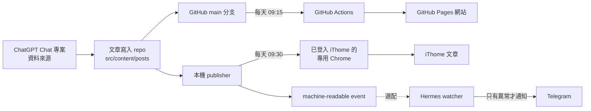

# iThome 2026 自動發文

這個專案會把同一篇文章，同步發布到兩個地方：

1. GitHub Pages：每天早上 09:15 更新網站。
2. iThome 鐵人賽：每天早上 09:30 用本機已登入的 Chrome 自動發布。

正常情況下不需要人在電腦前按「發布」。如果遇到登入失效、驗證碼、文章資料不完整，系統會停止，不會亂按。Hermes 監控是選配；有安裝時，只有發生問題才會用 Telegram 通知人處理。

> 目前程式與本機模擬測試已完成，但正式文章、09:30 本機排程、Day 1 真實發布，以及連續 30 天的實際運作，仍要等正式開賽日期與文章準備好後驗收。

## 整體流程



白話來說：文章只維護一份，放在這個 repo。GitHub Actions 負責網站，本機 publisher 責責 iThome。兩邊不共用密碼，也不把瀏覽器登入資料放進 GitHub。

## 小白只要先準備三件事

1. 把這個 repo 交給 AI Agent。
2. 告訴 Agent 正式的 Day 1 日期，例如「Day 1 是 2026-09-01」。不要只說「開賽那天」，一定要給完整日期。
3. 確認每天的正式文章已經放進 `src/content/posts/day-01.md` 到 `day-30.md`。

如果文章來自 ChatGPT Chat 專案的「資料來源」，可以授權 ChatGPT 或 Agent 直接寫入這個 repo，不需要先複製到其他中繼文件。

## 可以直接貼給 AI Agent 的指令

把下面這段連同 repo 一起交給 Agent，再補上正式 Day 1 日期：

```text
請接手這個 iThome 2026 自動發文 repo。

先完整閱讀 README.md，以及
.agents/skills/ithome-ironman-publisher/SKILL.md。

先做唯讀檢查，再修改任何檔案：
1. 執行 git status，保護目前尚未提交的變更，不可 reset、restore、checkout 或 clean。
2. 確認 src/content/posts/day-01.md 到 day-30.md 是否齊全。
3. 確認 GitHub Actions 的發布時間是 Asia/Taipei 09:15。
4. 確認本機 iThome publisher、Chrome CDP 與測試目前的狀態。
5. 清楚區分「程式已完成」、「排程已安裝」與「正式發布已驗收」，不可混在一起。

正式 Day 1 日期是：YYYY-MM-DD。
請依這個日期建立 Day 1 到 Day 30 的明確日期對照，不可從今天日期或 iThome 畫面猜 Day。

先執行 pnpm install、pnpm test:ithome、pnpm build 做本機驗證。
遇到文章缺漏、登入失效、Cloudflare、CAPTCHA、HTTP 429、頁面結構不確定，或無法唯一確認文章時，立即停止並回報，不可嘗試亂按或重複發布。

沒有我的明確授權，不可 commit、push、merge、部署、安裝正式排程或點擊真實發布。
如果我另外授權正式安裝，再完成 09:30 本機排程與一次受控驗收，並回報哪些項目已完成、哪些仍待開賽後確認。
```

## 第一次設定

以下工作通常只要做一次。看不懂指令時，可以直接把本節交給 AI Agent 執行。

### 1. 安裝專案工具

```bash
pnpm install
pnpm test:ithome
pnpm build
```

三個指令都成功，代表程式可以在本機執行；不代表已經真的發布到 iThome。

### 2. 準備文章

每篇文章放在：

```text
src/content/posts/day-01.md
src/content/posts/day-02.md
...
src/content/posts/day-30.md
```

文章至少要有這些欄位：

```yaml
---
title: "文章標題"
description: "文章摘要"
publishDate: 2026-09-01
tags: [AI, Agent]
draft: true
series: "系列名稱"
day: 1
---
```

寫作期間保留 `draft: true`。正式發布前，Agent 必須核對 Day、日期、標題與內容，再改成 `draft: false`。

不要在文章裡放 iThome cookie、Chrome 登入資料、Telegram token 或其他密碼。

### 3. 檢查單篇文章

以 Day 1 為例：

```bash
pnpm ithome:prepare -- --day 1 --json
```

這個指令會檢查文章，並產生 publisher 要使用的發布資料。它不會點擊 iThome 的「發布」。

### 4. 設定 GitHub Pages

文章合併並推送到 GitHub 的 `main` 分支後，GitHub Actions 會依工作流程在台北時間每天 09:15 建置網站。

09:15 比 iThome 的 09:30 早 15 分鐘，是為了讓 iThome 發文時，文章裡的 GitHub Pages 連結已經可以開啟。

repo 的工作流程已設定為每天 09:15。完成 commit、push 後，仍要看到 GitHub Actions 成功執行，才能算正式生效。

### 5. 準備專用 Chrome

iThome 自動發布使用一個獨立的 Chrome 使用者資料夾。第一次要由人手動登入 iThome，之後 publisher 才能沿用這個登入狀態。

範例：

```bash
/Applications/Google\ Chrome.app/Contents/MacOS/Google\ Chrome \
  --remote-debugging-address=127.0.0.1 \
  --remote-debugging-port=9223 \
  --user-data-dir="$HOME/.ithome-publisher-chrome" \
  https://ithelp.ithome.com.tw/
```

注意：

- `127.0.0.1` 代表只有這台電腦可以連線，不可改成公開網路位址。
- Chrome 使用者資料夾不可放進 repo。
- 不要複製 cookie 給 Agent；Agent 只操作這個已授權、已登入的 Chrome。
- 如果 iThome 要求重新登入，請由人手動完成。

### 6. 設定本機 publisher

```bash
export ITHOME_BROWSER_CDP_URL="http://127.0.0.1:9223"
export ITHOME_SERIES_TITLE="你的 iThome 鐵人賽系列名稱"
export ITHOME_IRONMAN_EDITION="18th鐵人賽"
```

這些是本機設定，不要把登入資料寫進 `.env` 後提交到 GitHub。

### 7. 先做不發布的驗證

正式安裝排程前，Agent 必須先確認：

- Chrome 可以連線。
- iThome 仍是正確帳號的登入狀態。
- 目標系列與 Day 能唯一對應。
- 文章資料完整。
- 測試與建置成功。

只有在使用者明確授權真實發布時，才可以執行：

```bash
pnpm ithome:publish-local -- --day 1
```

這是會操作真實 iThome 的指令，不是一般測試指令。

## 每天如何自動運作

正式安裝後，預期流程如下：

1. 09:15，GitHub Actions 更新 GitHub Pages。
2. 09:30，本機排程用明確的日期對照找出今天是 Day 幾。
3. publisher 讀取該 Day 的 repo 文章與發布資料。
4. publisher 連到本機已登入的 Chrome。
5. publisher 檢查帳號、系列、Day、標題與內容。
6. 全部吻合時，只點擊一次發布。
7. 發布後寫出 machine-readable event，供稽核或 Hermes 監控使用。
8. 發生不確定狀況時直接停止，不重試發布。

「只點一次」很重要。因為網路慢時，系統可能看不到成功畫面；這時不能再點第二次，否則可能重複發文。

## AI Agent 必須遵守的規則

Agent 可以讀文章、執行測試、產生發布資料與操作已授權的本機 Chrome，但必須遵守以下規則：

- Day 必須由使用者提供的 Day 1 日期計算，不可猜。
- repo 是文章唯一正式來源，不可使用 iThome 舊草稿偷偷取代 repo 文章。
- 不可刪除 iThome 草稿。
- 不可覆寫或修改已公開的 iThome 文章。
- 不可把 Chrome profile、cookie、Telegram credential 或其他密碼寫進 repo。
- 不可在不確定頁面狀態時繼續點擊。
- 發布結果不明時不可自動重試。
- 未經明確授權，不可 commit、push、merge、部署、安裝排程或進行真實發布。
- 修改前先看 `git status`，保護使用者現有的 dirty worktree。
- 回報時要分開寫清楚：本機測試、瀏覽器驗證、排程安裝、真實發布、Telegram 通知各自是否完成。

以下任一情況發生時，Agent 必須停止並通知人：

- 找不到指定 Day 的正式文章。
- 同一個 Day 找到多篇文章或多個 iThome 草稿。
- 標題、系列、Day、同步識別或文章內容不一致。
- iThome 登入失效。
- 出現 Cloudflare、CAPTCHA、HTTP 429 或其他擋機器人的畫面。
- 找不到預期按鈕，或無法判斷是否已發布。
- 發布後無法確認結果。

這種做法稱為「失敗時關閉」（fail closed）：有疑問就停，不拿正式文章冒險。

## Hermes 監控是選配

沒有 Hermes，GitHub Pages 與 iThome 自動發布仍可運作。Hermes 是選配的自動外部驗證與異常通知層。

啟用 Hermes 後，它仍然會檢查 iThome 的公開系列文章列表，但不需要人工每天設定文章網址。Day 1 建立有效的 `verified bootstrap state` 後，watcher 會把已確認的公開系列網址交給 Hermes 既有的公開系列頁 watchdog。watchdog 再定期查看公開列表，確認讀者真的看得到當天文章。

Hermes 會做兩層檢查：

1. **Publisher event**：確認本機 publisher 回報了什麼，例如成功、失敗、缺少文章或資料不一致。
2. **iThome 公開系列頁**：從讀者看得到的公開頁面再次確認文章確實出現在列表中。

第二層很重要，因為「publisher 回報成功」不一定等於「公開頁面已經看得到文章」。

如果要使用 Hermes：

- publisher 把事件寫到 `/Users/Shared/ithome-ironman-bridge/events/`。
- Day 1 的已驗證系列資料放在 `/Users/Shared/ithome-ironman-bridge/state/series-bootstrap.json`。
- verified bootstrap state 就緒後，自動把已確認的公開系列網址交給既有 public-series watchdog。
- 不需要每天手動指定文章網址，也不需要替 Day 1 到 Day 30 分別建立監控工作。
- Hermes 只查看公開文章列表，不登入 iThome、不讀取草稿，也不取得文章正文。
- Hermes 只能讀取共享 bridge，不可回寫。
- Hermes 自己的去重與 `lastNotified` 狀態，要放在 Hermes 自己可寫的目錄。
- 正常成功時保持安靜。
- 只有 missing、duplicate、mismatch、failed、stale 等異常才透過既有 Telegram Gateway 通知。
- 不建立第二個 Telegram poller，也不把 Telegram credential 交給 Codex 或 repo。

目前 Hermes watcher 已能每 5 分鐘檢查一次，也曾成功送出真實異常通知；但它不是自動發文的必要元件。公開系列頁的正式網路檢查仍要等 Day 1 產生有效的 verified bootstrap state 後，才能完成開賽實測。

## Day 1 為什麼比較特別

Day 1 發布後，系統才會知道 iThome 正式建立的系列識別與公開系列頁。這份資料叫做 `verified bootstrap state`，白話就是「確認過的系列身分資料」。

因此：

- Day 1 必須先完成一次受控的真實發布與驗證。
- Day 2 到 Day 30 只能使用已驗證的 Day 1 系列資料。
- 如果 Day 1 到了 19:00 或 22:30 仍沒有有效資料，Hermes 選配監控應通知人工處理。

目前 Day 1 bootstrap state 的自動寫入尚未完成，因此不能把 Day 2 到 Day 30 的真實連續發布視為已驗收。

## 目前完成到哪裡

已完成：

- GitHub Pages 工作流程已設定為每天 09:15。
- iThome browser adapter 與本機 publisher 已實作。
- 本機測試與網站建置已通過。
- 已用專用 Chrome 做過真實登入狀態與草稿的唯讀檢查。
- 發布流程遇到不確定狀況時會停止。
- Hermes 選配 watcher 已完成一次真實異常 Telegram 通知驗收。

尚未完成或仍待正式開賽驗收：

- 正式 Day 1 日期尚未寫入明確日期對照。
- `day-01.md` 到 `day-30.md` 正式文章尚未全部備妥。
- GitHub Pages 09:15 排程尚待遠端 GitHub Actions 成功紀錄確認。
- 09:30 本機 publisher 正式排程尚未安裝。
- Day 1 真實發布按鈕尚未點擊驗收。
- Day 1 verified bootstrap state 尚未自動建立。
- Day 2 到 Day 30 尚未經過真實連續發布驗收。

所以，目前可以繼續準備與合併程式，但不能宣稱「正式自動發文已完整驗收」。確定 Day 1 日期並準備好正式文章後，再完成排程安裝與開賽實測。

## 常見名詞

- **repo**：這個專案資料夾，也是文章與程式的正式來源。
- **publisher**：負責把 repo 文章發布到 iThome 的本機程式。
- **payload**：publisher 準備好的單篇發布資料包。
- **CDP**：讓本機程式控制專用 Chrome 的連線方式。
- **bootstrap state**：Day 1 後確認過的 iThome 系列身分資料。
- **watcher**：只負責檢查結果、不負責發布文章的監控程式。
- **dirty worktree**：repo 裡還沒 commit 的修改；Agent 必須保護它，不能擅自清除。

## 更完整的技術文件

- Publisher 操作規則：`.agents/skills/ithome-ironman-publisher/SKILL.md`
- 無人值守 runner：`.agents/skills/ithome-ironman-publisher/references/unattended-runner.md`
- 事件契約：`.agents/skills/ithome-ironman-publisher/references/event-contract.md`
- Day 1 bootstrap 契約：`.agents/skills/ithome-ironman-publisher/references/bootstrap-state.md`
